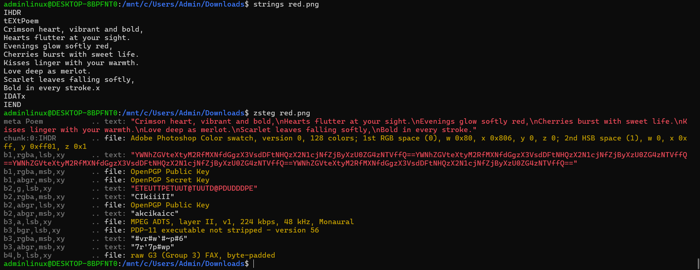

# Challenge Name
RED

## Approach
(how you started, what you tried)
started by opening the image found nothing. then used strings red.png. after staring at it for a while the first letter of the words 
asked me to check "LSB". i googled the meaning of it and how to search for one. then i installed ruby and then installed zsteg.
i ran the command and got a base64 string, which i decoded through an online tool.

## Solution
(the actual technique ,code, commands, screenshots)

## Flag
academy{r3d_1s_th3_ult1m4t3_cur3_f0r_54dn355_}

## Takeaway
images can contain hidden texts

# Challenge Name
CanYouSeeMe

## Approach
(how you started, what you tried)
started by looking at the image, nothing interesting. then proceeded to use file/strings/binwalk which didnt help. i used exiftool
which had a base 64 string in the attribution URL. i then decoded it through an online tool

## Solution
(the actual technique ,code, commands, screenshots)
![Solution][2.png]

## Flag
academy{ME74D47A_HIDD3N_9266de1e}

## Takeaway
carefully look at all outputs after running files/strings/binwalk/exiftool. can find something there.